<div align="center">

# Hi there 👋 I am Pedro Loschi

<a href="https://loschiii.github.io/portifolio/"></a>

[](https://www.linkedin.com/in/pedroloschigiov)
[](https://loschiii.github.io/portifolio/)
[](mailto:pedroloschigiov@gmail.com)
[](https://loschiii.github.io/portifolio/assets/Pedro_Loschi_Giovannini_Resume.pdf)

<br>


<!-- These two cards are generated by .github/workflows/update-cards.yml and
     committed into this repo, so they never break due to a third-party outage. -->



<br><br>

**Languages**


**Frontend**


**Backend & Data**


**AI & Tools**


</div>

---

## About me:

```console
$ whoami
> pedro loschi giovannini — software engineer · rio de janeiro, brazil
$ cat status.txt
> shipping AI products for a real client. open to new challenges.
```

- 💻 Computer Science undergrad at **PUC-Rio** — admitted **1st place** in the entrance exam
- 🎖️ **Full merit scholar** of Fundação Behring, covering my entire degree
- 🚀 **Software Engineer** at **Instituto ECOA** (PUC-Rio × Petrobras *Ignição* program) — I turn validated MVPs into production-ready products
- 🤖 Building with **LLMs**: document intelligence, semantic search and AI assistants
- 🧑‍🏫 **Python Teaching Assistant** at PUC-Rio — helping new programmers think in logic and debug with patience
- 🌎 Rio de Janeiro, Brazil · Portuguese (native) · English (fluent) · Spanish (basic)

---

## What I'm building:

| Project | What it does | Stack |
| :--- | :--- | :--- |
| **🔍 Oráculo** | Verifies documents with AI, flagging inconsistencies against internal standards and ranking them by severity | `Django` `OpenAI` `pypdf` `scikit-learn` |
| **🔷 Prisma** | AI assistant inside Microsoft 365 — turns SharePoint content into summaries, narrated audio and slides | `SPFx` `TypeScript` `React` `Flask` |
| **🐝 Bee** | Semantic search across **8.9M+ Brazilian researchers**, matching expertise through embeddings | `Django` `PostgreSQL` `Vector DB` |
| **⚡ [Portfolio](https://github.com/loschiii/portifolio)** | My site, built from scratch — zero frameworks, EN/PT, light/dark themes, particle canvas | `HTML` `CSS` `JavaScript` |

> 🔒 The first three were designed, validated and delivered to **Petrobras** through the Ignição program — the source code is confidential, but the full story and screenshots live on my [portfolio](https://loschiii.github.io/portifolio/#projetos).

---

## Contacts:

- 📫 Reach me at **[pedroloschigiov@gmail.com](mailto:pedroloschigiov@gmail.com)**
- 💼 Let's connect on **[LinkedIn](https://www.linkedin.com/in/pedroloschigiov)**
- 🌐 See the full work at **[loschiii.github.io/portifolio](https://loschiii.github.io/portifolio/)**

<div align="center">
<br>

*Open to internship opportunities, ambitious projects and good conversations about technology.*

<br>


</div>
